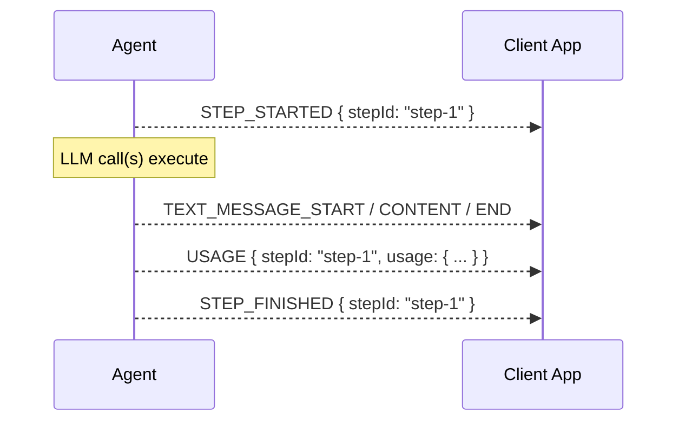

# Usage Events Proposal

## Summary

### Problem Statement

Agents consume LLM tokens across multiple steps within a run, but there is no
standardized way to surface token usage information through the AG-UI event
stream. Clients have no visibility into how many tokens are being consumed,
making it difficult to implement cost tracking, budget enforcement, or usage
analytics.

### Motivation

AG-UI should support **token usage reporting** as a first-class concern.

- **Cost visibility**: Clients need per-step and per-run token consumption data
  to display costs, enforce budgets, and enable usage-based billing.
- **Provider normalization**: Different LLM providers report usage in different
  formats. AG-UI should define a common schema that accommodates
  provider-specific breakdowns (cached tokens, reasoning tokens, multimodal
  tokens) while keeping the core fields simple.
- **Backwards compatibility**: Existing AG-UI clients must keep working
  unchanged. Usage events are additive and optional.

## Status

- **Status**: Draft
- **Author(s)**: Alem Tuzlak (t.zlak97@gmail.com)

## Detailed Specification

### Overview

This proposal introduces:

- A new `USAGE` event type emitted per completed step
- A `TokenUsage` type capturing core counts and optional detailed breakdowns
- Support for provider-specific usage details

## New Type: TokenUsage

```typescript
type TokenUsage = {
  // Core token counts (always present when usage is available)
  inputTokens: number
  outputTokens: number
  totalTokens: number

  // Detailed prompt token breakdown
  inputTokensDetails?: {
    cachedTokens?: number // Tokens from prompt cache hits
    cacheWriteTokens?: number // Tokens written to cache
    audioTokens?: number // Audio input tokens
    videoTokens?: number // Video input tokens
    imageTokens?: number // Image input tokens
    textTokens?: number // Text input tokens
  }

  // Detailed completion token breakdown
  outputTokensDetails?: {
    reasoningTokens?: number // Reasoning/thinking tokens (o1, Claude)
    audioTokens?: number // Audio output tokens
    videoTokens?: number // Video output tokens
    imageTokens?: number // Image output tokens
    textTokens?: number // Text output tokens
    // Duration (for some billing models)
    durationSeconds?: number
  }

  // Provider-specific details
  providerUsageDetails?: Record<string, any>
}
```

### Core Fields

| Property       | Type     | Required | Description                                   |
| -------------- | -------- | -------- | --------------------------------------------- |
| `inputTokens`  | `number` | Yes      | Number of tokens in the prompt                |
| `outputTokens` | `number` | Yes      | Number of tokens in the completion            |
| `totalTokens`  | `number` | Yes      | Total tokens consumed (`prompt + completion`) |

### Input Token Details

| Property           | Type      | Description                          |
| ------------------ | --------- | ------------------------------------ |
| `cachedTokens`     | `number?` | Tokens served from prompt cache hits |
| `cacheWriteTokens` | `number?` | Tokens written to prompt cache       |
| `audioTokens`      | `number?` | Audio input tokens                   |
| `videoTokens`      | `number?` | Video input tokens                   |
| `imageTokens`      | `number?` | Image input tokens                   |
| `textTokens`       | `number?` | Text input tokens                    |

### Output Token Details

| Property          | Type      | Description                                          |
| ----------------- | --------- | ---------------------------------------------------- |
| `reasoningTokens` | `number?` | Reasoning/thinking tokens (e.g. o1, Claude thinking) |
| `audioTokens`     | `number?` | Audio output tokens                                  |
| `videoTokens`     | `number?` | Video output tokens                                  |
| `imageTokens`     | `number?` | Image output tokens                                  |
| `textTokens`      | `number?` | Text output tokens                                   |
| `durationSeconds` | `number?` | Wall-clock duration of the step (for billing)        |

### Additional Fields

| Property               | Type                   | Description                                |
| ---------------------- | ---------------------- | ------------------------------------------ |
| `providerUsageDetails` | `Record<string, any>?` | Arbitrary provider-specific usage metadata |

## New Event: UsageEvent

Emitted once per completed step with the token usage for that step.

```typescript
type UsageEvent = BaseEvent & {
  type: EventType.USAGE
  /**
   * The step ID this usage corresponds to.
   */
  stepId?: string
  /**
   * Token usage for the completed step.
   */
  usage: TokenUsage
}
```

| Property | Type         | Required | Description                             |
| -------- | ------------ | -------- | --------------------------------------- |
| `stepId` | `string?`    | No       | Associates usage with a specific step   |
| `usage`  | `TokenUsage` | Yes      | Token usage data for the completed step |

### Event Lifecycle

The `USAGE` event is emitted **after** a step completes, typically immediately
before or after the corresponding `STEP_FINISHED` event:



## Implementation Examples

### Basic Usage Event

```json
{
  "type": "USAGE",
  "timestamp": 1714063982000,
  "stepId": "step-001",
  "usage": {
    "inputTokens": 1250,
    "outputTokens": 340,
    "totalTokens": 1590
  }
}
```

### Usage with Cache Details (OpenAI)

```json
{
  "type": "USAGE",
  "timestamp": 1714063985000,
  "stepId": "step-002",
  "usage": {
    "inputTokens": 2000,
    "outputTokens": 500,
    "totalTokens": 2500,
    "inputTokensDetails": {
      "cachedTokens": 1500,
      "textTokens": 500
    },
    "outputTokensDetails": {
      "textTokens": 500
    }
  }
}
```

### Usage with Reasoning Tokens (o1 / Claude)

```json
{
  "type": "USAGE",
  "timestamp": 1714064001000,
  "stepId": "step-003",
  "usage": {
    "inputTokens": 3200,
    "outputTokens": 1800,
    "totalTokens": 5000,
    "outputTokensDetails": {
      "reasoningTokens": 1200,
      "textTokens": 600
    }
  }
}
```

### Usage with Cache Tokens

```json
{
  "type": "USAGE",
  "timestamp": 1714064100000,
  "stepId": "step-004",
  "usage": {
    "inputTokens": 4000,
    "outputTokens": 600,
    "totalTokens": 4600,
    "inputTokensDetails": {
      "cachedTokens": 1500,
      "cacheWriteTokens": 2000,
      "textTokens": 500
    }
  }
}
```

### Multimodal Usage

```json
{
  "type": "USAGE",
  "timestamp": 1714064200000,
  "stepId": "step-005",
  "usage": {
    "inputTokens": 8500,
    "outputTokens": 450,
    "totalTokens": 8950,
    "inputTokensDetails": {
      "imageTokens": 6500,
      "textTokens": 2000
    },
    "outputTokensDetails": {
      "textTokens": 450
    }
  }
}
```

### Provider-Specific Details

```json
{
  "type": "USAGE",
  "timestamp": 1714064300000,
  "stepId": "step-006",
  "usage": {
    "inputTokens": 1000,
    "outputTokens": 200,
    "totalTokens": 1200,
    "outputTokensDetails": {
      "textTokens": 200,
      "durationSeconds": 2.35
    },
    "providerUsageDetails": {
      "model": "gpt-4o-2025-01-01",
      "serviceVersion": "2025-01",
      "billingTier": "standard"
    }
  }
}
```

## Use Cases

### Cost Tracking and Dashboards

Aggregate `TokenUsage` across steps and runs to display real-time token
consumption and estimated costs in the client UI.

### Budget Enforcement

Clients can monitor cumulative usage during a run and cancel or pause execution
when a token budget threshold is reached.

### Usage-Based Billing

Platforms embedding AG-UI agents can meter token consumption per user or
organization using the structured usage data.

### Cache Efficiency Monitoring

Track the ratio of cached vs. uncached prompt tokens to optimize prompt design
and reduce costs through effective caching strategies.

### Reasoning Cost Analysis

Identify how many tokens are consumed by reasoning/thinking vs. visible output,
helping users understand the cost breakdown of reasoning-heavy models.

### Multimodal Cost Attribution

Separate token consumption by modality (text, image, audio, video) to understand
the cost profile of multimodal interactions.

## Implementation Considerations

### Client SDK Changes

TypeScript SDK:

- New `USAGE` value in `EventType` enum
- `TokenUsage` type and `UsageEvent` schema in `@ag-ui/core`
- Usage event handlers in the subscriber
- Helper utilities for aggregating usage across steps

Python SDK:

- New `UsageEvent` class in `ag_ui.core.events`
- `TokenUsage` model with Pydantic validation
- Usage aggregation utilities

### Aggregation Pattern

Clients are expected to aggregate usage across steps for per-run totals. A
recommended pattern:

```typescript
let runUsage = { inputTokens: 0, outputTokens: 0, totalTokens: 0 }

agent.on("USAGE", (event) => {
  runUsage.inputTokens += event.usage.inputTokens
  runUsage.outputTokens += event.usage.outputTokens
  runUsage.totalTokens += event.usage.totalTokens
})
```

### Provider Mapping

Middleware or agent implementations are responsible for mapping
provider-specific usage responses into the `TokenUsage` schema. The
`providerUsageDetails` field preserves any additional data that doesn't fit the
normalized structure.

### Backward Compatibility

- Clients not handling `USAGE` events continue to work unchanged
- Usage events are entirely optional; agents may omit them
- No changes required to existing integrations

## Testing Strategy

- Unit tests for `TokenUsage` validation and `UsageEvent` schema
- Integration tests verifying usage events are emitted per step
- Aggregation tests for multi-step runs
- Provider mapping tests for OpenAI, Anthropic, and other providers
- Backward compatibility tests with clients ignoring usage events

## References

- [AG-UI Events Documentation](/concepts/events)
- [OpenAI Usage Object](https://platform.openai.com/docs/api-reference/chat/object#chat/object-usage)
- [Anthropic Usage Object](https://platform.claude.com/docs/en/agent-sdk/cost-tracking)
- [OpenRouter Usage Tracking](https://openrouter.ai/docs/guides/guides/usage-accounting)
